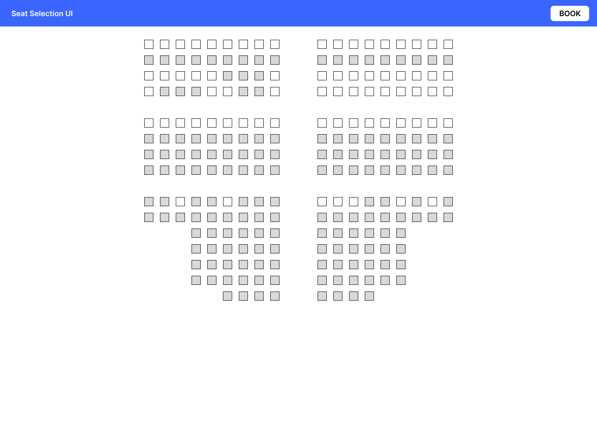

# movie-seat-selection
Create a simple HTML file that allows user to select seats for a hypothetical movie.

## Source code organisation and file name conventions
Following are the list of files and directories to create for this project:
1. index.html - Contains the front end code
2. assets/main.css - Define all the styles
3. scripts/main.js - Define all the javascript logics and event handlers

## Requirement
1. User should be able to select an available seat from the seat layout.
2. User should be able to book the selected seat.
3. Once the seat is booked, user should not be able to select for booking.
4. To book the seat, user should be able to click on the **BOOK** button.
